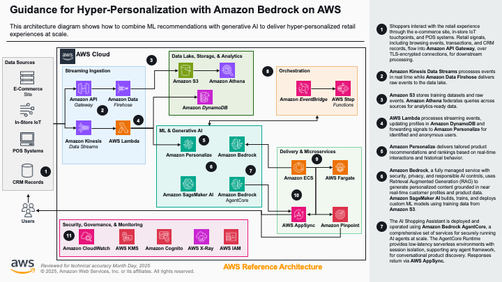
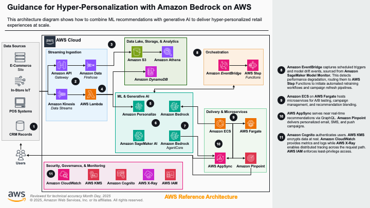

# Guidance for Retail Hyper-Personalization on AWS

## Table of Contents

1. [Overview](#overview)
    - [Architecture](#architecture)
    - [Cost](#cost)
2. [Prerequisites](#prerequisites)
    - [Operating System](#operating-system)
    - [AWS Account Requirements](#aws-account-requirements)
    - [Model Configuration](#model-configuration)
    - [Service Limits](#service-limits)
    - [Supported Regions](#supported-regions)
3. [Deployment Steps](#deployment-steps)
4. [Deployment Validation](#deployment-validation)
5. [Running the Guidance](#running-the-guidance)
6. [Security Considerations](#security-considerations)
7. [Next Steps](#next-steps)
8. [Cleanup](#cleanup)
9. [Notices](#notices)

## Overview

This Guidance helps retailers offer personalized experiences to shoppers through machine learning (ML) services and generative AI capabilities. It deploys a fully functional e-commerce storefront with:

- **Personalized product recommendations** powered by Amazon Personalize, delivering individually tailored suggestions based on user behavior and preferences
- **AI Shopping Assistant** powered by Amazon Bedrock AgentCore Runtime, enabling conversational product discovery through natural language
- **Semantic product search** via Knowledge Bases for Amazon Bedrock (RAG), allowing customers to find products by describing what they need rather than using exact keywords
- **Real-time interaction tracking** that feeds back into the recommendation model for continuous improvement

The sample demonstrates the "dual AI strategy" from the guidance architecture: Amazon Personalize handles behavioral recommendation algorithms while Amazon Bedrock provides natural language understanding and generation for conversational commerce.

### Architecture





The architecture implements two primary data flows from the guidance:

**Data Flow 1 — Real-Time Personalization:**
1. User browses the storefront → frontend requests recommendations via API Gateway
2. Lambda invokes Amazon Personalize campaign with the user's ID
3. Personalize returns ranked product recommendations based on interaction history
4. Lambda enriches results with product metadata from DynamoDB
5. Frontend displays personalized "Recommended for You" and "You May Also Like" sections

**Data Flow 2 — AI Shopping Assistant:**
1. Customer sends a natural language query via WebSocket
2. Lambda invokes Bedrock AgentCore Runtime with the message
3. Agent uses tools to search the Knowledge Base (semantic product search), call Personalize (personalized ranking), and query DynamoDB (product details)
4. Agent generates a conversational response with product recommendations
5. Response streams back to the customer with clickable product cards

### Cost

You are responsible for the cost of the AWS services used while running this Guidance. As of May 2026, the cost for running this Guidance with the default settings in US East (N. Virginia) is approximately **$400–450 per month** for a low-traffic demo environment. The majority of this cost comes from OpenSearch Serverless (minimum 2 OCUs).

We recommend creating a [Budget](https://docs.aws.amazon.com/cost-management/latest/userguide/budgets-managing-costs.html) through [AWS Cost Explorer](https://aws.amazon.com/aws-cost-management/aws-cost-explorer/) to help manage costs. Prices are subject to change. For full details, refer to the pricing webpage for each AWS service used in this Guidance.

**Important:** To minimize costs during evaluation, destroy the stack when not in use (see [Cleanup](#cleanup)). OpenSearch Serverless charges apply continuously while the collection exists.

| AWS Service | Dimensions | Cost [USD] |
| ----------- | ---------- | ---------- |
| OpenSearch Serverless | 2 OCU minimum (indexing + search) | ~$350/month |
| Amazon Personalize | 1 campaign (1 TPS min provisioned) | ~$25/month |
| Amazon Bedrock (inference) | ~1,000 agent invocations/month (Claude Sonnet) | ~$15/month |
| Amazon Bedrock (Knowledge Base) | 200 documents indexed, ~500 queries/month | ~$5/month |
| Bedrock AgentCore Runtime | 1 agent runtime | ~$10/month |
| Amazon DynamoDB | On-demand, <1GB storage | ~$1/month |
| AWS Lambda | ~10,000 invocations/month | ~$0.50/month |
| Amazon CloudFront + S3 | Static site + product images (~600MB) | ~$3/month |
| Amazon Cognito | <100 active users | $0.00 |
| API Gateway (HTTP + WebSocket) | ~10,000 requests/month | ~$1/month |
| AWS WAF | 1 Web ACL | ~$5/month |
| AWS KMS | 1 key + ~1,000 requests/month | ~$1/month |

## Prerequisites

### Operating System

These deployment instructions are optimized for **macOS** or **Amazon Linux 2023**. Deployment on Windows may require additional steps (e.g., using WSL2).

Required tools:
- Node.js >= 18 (`node --version`)
- Python >= 3.11 (`python3 --version`)
- AWS CLI v2 (`aws --version`)
- AWS CDK CLI (`npm install -g aws-cdk`)
- Docker (for building the agent container)

### AWS Account Requirements

- Amazon Bedrock model access enabled for the models configured in
  [Model Configuration](#model-configuration). With the defaults, that means:
  - `anthropic.claude-sonnet-4-20250514-v1:0` (or cross-region `us.anthropic.claude-sonnet-4-20250514-v1:0`)
  - `amazon.titan-embed-text-v2:0`
- Sufficient service quotas for Amazon Personalize, OpenSearch Serverless, and Bedrock AgentCore
- IAM permissions to create all resources in the stack

### Model Configuration

Foundation model IDs are configuration rather than source code, so you can point
this Guidance at different models — for example when a model is deprecated —
without editing the application. They are set as CDK context values in
[`source/deploy/cdk.json`](source/deploy/cdk.json):

| Context value | Default | Purpose |
| --- | --- | --- |
| `bedrock_model_id` | `us.anthropic.claude-sonnet-4-20250514-v1:0` | Model used by the AI Shopping Assistant agent |
| `embedding_model_id` | `amazon.titan-embed-text-v2:0` | Embedding model used by the Knowledge Base |
| `embedding_model_dimensions` | `1024` | Vector dimensions produced by `embedding_model_id` |

Either edit `cdk.json` or override at deploy time:

```bash
cd source/deploy
npx cdk deploy --all --require-approval=never \
    -c bedrock_model_id=us.anthropic.claude-sonnet-4-5-20250929-v1:0
```

All three values are validated at synth time and deployment fails with an
explicit error if any is missing or malformed, rather than failing after
deployment.

**Important:** `embedding_model_id` and `embedding_model_dimensions` must stay
consistent with each other. The dimension count is written into the OpenSearch
Serverless vector index, which is immutable once created — so changing the
embedding model on an existing deployment requires recreating the index and
Knowledge Base, and re-running ingestion.

The data generation pipeline configures its models separately; see
[`source/data-generation/README.md`](source/data-generation/README.md).

### aws cdk bootstrap

If you are using AWS CDK for the first time in your account/region, run:

```bash
cdk bootstrap aws://<ACCOUNT_ID>/us-east-1
```

### Service Limits

- Amazon Personalize: Default limits support this deployment
- OpenSearch Serverless: Minimum 2 OCUs required (default limit is sufficient)
- Bedrock AgentCore: 1 runtime per deployment

### Supported Regions

This Guidance is designed for deployment in **US East (N. Virginia) - us-east-1**. Amazon Bedrock AgentCore, Amazon Personalize, and OpenSearch Serverless availability may vary by region.

## Deployment Steps

### Option A: One-Click Deploy (Recommended)

1. Clone the repository:
```bash
git clone https://github.com/aws-solutions-library-samples/guidance-for-retail-hyper-personalization-on-aws.git
cd guidance-for-retail-hyper-personalization-on-aws
```

2. Run the deployment script:
```bash
chmod +x deployment/deploy.sh
./deployment/deploy.sh
```

This script handles all steps: installing dependencies, building the web app, deploying infrastructure, uploading data, and starting Personalize training.

### Option B: Step-by-Step Deploy

1. Clone the repository:
```bash
git clone https://github.com/aws-solutions-library-samples/guidance-for-retail-hyper-personalization-on-aws.git
cd guidance-for-retail-hyper-personalization-on-aws/source
```

2. Install dependencies:
```bash
npm install --prefix web-app
npm install --prefix deploy
npm install --prefix js-lambdas
pip install boto3
```

3. Build the JWT Lambda layer:
```bash
bash js-layers/jwt-layer/build.sh
```

4. Build the web application:
```bash
npm run build --prefix web-app
```

5. Deploy the infrastructure:
```bash
cd deploy
npx cdk deploy --all --require-approval=never
cd ..
```

6. Run post-deploy setup (upload images, seed database, sync Knowledge Base):
```bash
bash scripts/post-deploy.sh
```

7. Set up Amazon Personalize (import data and train model):
```bash
python3 scripts/setup_personalize.py --region us-east-1
```

8. Wait for Personalize training to complete (~1-2 hours), then create the campaign:
```bash
python3 scripts/setup_personalize.py --region us-east-1 --skip-import --skip-training
```

9. Create a Cognito user for testing:
```bash
aws cognito-idp admin-create-user \
    --user-pool-id <USER_POOL_ID> \
    --username demo \
    --temporary-password 'TempPass123!' \
    --region us-east-1
```

**Note:** Sample product data (catalog, images, and training datasets) is pre-included in the repository under `source/data-generation/`. To regenerate with different products, see `source/data-generation/README.md`.

## Deployment Validation

- Open the AWS CloudFormation console and verify the stacks `retail-personalization-on-aws` and `retail-personalization-on-aws-waf` show status `CREATE_COMPLETE`
- Verify the CloudFront distribution URL is accessible (check stack outputs)
- Run the following to confirm all resources:
```bash
aws cloudformation describe-stacks --stack-name retail-personalization-on-aws --region us-east-1 --query "Stacks[0].StackStatus"
```
Expected output: `"CREATE_COMPLETE"`

## Running the Guidance

1. Open the CloudFront URL from the stack outputs in your browser
2. Sign in with the Cognito user credentials (you'll be prompted to set a new password on first login)
3. Browse the storefront — the "Recommended for You" section shows personalized products from Amazon Personalize
4. Click on a product to see the detail page with "You May Also Like" recommendations
5. Click the chat bubble (bottom-right) to open the AI Shopping Assistant
6. Ask questions like:
   - "I'm looking for a mid-century modern bookshelf"
   - "What do you recommend for a cozy reading corner?"
   - "Show me dining tables under $1,500"
   - "I need warm lighting for my bedroom"

The assistant will search the product catalog semantically, provide personalized recommendations, and show clickable product cards with images.

## Security Considerations

This Guidance is a demonstration deployment. Review the following before adapting
it for production use.

### IAM permissions

IAM policies in this Guidance are scoped to specific resource ARNs wherever the
service supports it — the Personalize campaign and event tracker, the Bedrock
Knowledge Base, the AgentCore runtime, the OpenSearch Serverless collection, and
the DynamoDB tables. Two permissions cannot be fully scoped, and you should
understand both:

**1. Bedrock model invocation with a cross-region inference profile.** The
default `bedrock_model_id` is a system-defined inference profile
(`us.anthropic.claude-sonnet-4-20250514-v1:0`). Bedrock requires
`bedrock:InvokeModel` on both the inference profile and the underlying
foundation model in *every* Region the profile routes to, and AWS controls that
Region set and changes it over time. The Region segment of the foundation-model
ARN is therefore a wildcard:

```
arn:aws:bedrock:*::foundation-model/anthropic.claude-sonnet-4-20250514-v1:0
```

The permission is still bound to one specific model rather than all of Bedrock,
and foundation-model ARNs contain no account ID, so no customer-owned resource is
in scope. If you need to eliminate the wildcard entirely, set
`bedrock_model_id` to a single-Region foundation model ID (see
[Model Configuration](#model-configuration)) — the policy then resolves to one
fully-qualified ARN — at the cost of losing cross-region throughput resilience.

**2. `aoss:BatchGetCollection`.** This action does not support resource-level
ARNs. Following the
[documented least-privilege pattern for OpenSearch Serverless](https://docs.aws.amazon.com/opensearch-service/latest/developerguide/serverless-collection-permissions.html),
it is granted on `Resource: "*"` constrained by an `aoss:collection` condition
key naming this deployment's collection, so the call cannot describe other
collections in the account.

Both are flagged by `cdk-nag` and carry targeted, evidence-bearing suppressions
scoped to the exact ARN rather than blanket wildcard exemptions.

### Knowledge Base network exposure

The OpenSearch Serverless collection backing the Knowledge Base is created with
a network policy of `AllowFromPublic: true`
([`knowledge-base-construct.ts`](source/deploy/src/constructs/knowledge-base-construct.ts)).
Its data-plane endpoint is therefore reachable from the public internet.

Access is still gated by IAM and SigV4 request signing — an unauthenticated
caller cannot read or write data — and in this Guidance only the Bedrock
Knowledge Base service role holds data-access permissions on the collection.
The endpoint being publicly resolvable is nonetheless a wider network surface
than production workloads should accept.

**For production,** place the collection behind an
[OpenSearch Serverless VPC endpoint](https://docs.aws.amazon.com/opensearch-service/latest/developerguide/serverless-vpc.html)
and change the network policy to `AllowFromPublic: false` with the VPC endpoint
listed in `SourceVPCEs`. This restricts the data-plane endpoint to traffic
originating inside your VPC.

### Other production hardening

The deployment is optimized for straightforward setup and teardown rather than
production operation. Before production use, review at minimum:

- **Cognito:** MFA and advanced security features are not enabled, and the user
  pool is created with a `DESTROY` removal policy.
- **API access logging:** access logging is not enabled on the HTTP API or the
  WebSocket API stage.
- **Data retention:** S3 buckets and DynamoDB tables use `DESTROY` removal
  policies with `autoDeleteObjects` so that `cdk destroy` leaves nothing behind.
  Production deployments should use `RETAIN`.
- **Encryption:** resources use AWS-managed keys (SSE-S3, AWS-managed DynamoDB
  encryption) rather than customer-managed KMS keys.
- **Bedrock Guardrails:** no guardrail is attached to the agent. Consider adding
  one to filter prompts and responses, since Knowledge Base content and product
  data flow into the model context.
- **Authorization:** the recommendations and events APIs accept a `userId`
  supplied by the caller. In production, derive the user identity from the
  validated JWT claims instead.

## Next Steps

- **Add real product data:** Replace the generated sample catalog with your actual product inventory
- **Enable real-time streaming:** Add Amazon Kinesis Data Streams for omnichannel event ingestion (as described in the full guidance architecture)
- **Add MLOps automation:** Implement AWS Step Functions workflows for automated Personalize model retraining
- **Integrate marketing campaigns:** Connect Amazon Pinpoint for personalized email/SMS campaigns with Bedrock-generated content
- **Scale for production:** Enable DynamoDB DAX for microsecond caching, configure Personalize auto-scaling, and add Bedrock Provisioned Throughput

## Cleanup

1. Destroy the CDK stacks:
```bash
cd source/deploy
npx cdk destroy --all --force
cd ../..
```

2. The following resources are automatically deleted:
   - All S3 buckets (with `autoDeleteObjects: true`)
   - DynamoDB tables
   - OpenSearch Serverless collection
   - Cognito user pool
   - All Lambda functions and API endpoints

3. Manually delete (if needed):
   - Amazon Personalize dataset group, solutions, and campaigns (these are not managed by CDK):
```bash
# Delete campaign first, then solution version, then solution, then datasets, then dataset group
aws personalize delete-campaign --campaign-arn <CAMPAIGN_ARN> --region us-east-1
```

## Notices

*Customers are responsible for making their own independent assessment of the information in this Guidance. This Guidance: (a) is for informational purposes only, (b) represents AWS current product offerings and practices, which are subject to change without notice, and (c) does not create any commitments or assurances from AWS and its affiliates, suppliers or licensors. AWS products or services are provided "as is" without warranties, representations, or conditions of any kind, whether express or implied. AWS responsibilities and liabilities to its customers are controlled by AWS agreements, and this Guidance is not part of, nor does it modify, any agreement between AWS and its customers.*

## Repository Structure

```
assets/                          — Architecture diagrams and images
deployment/
  deploy.sh                      — One-click deployment script
source/
  agent/                         — Python AI Shopping Assistant (Bedrock AgentCore + Strands Agents)
  deploy/                        — AWS CDK infrastructure (TypeScript)
  js-lambdas/                    — Lambda functions (recommendations API, events API, WebSocket chat)
  js-layers/                     — Lambda layers (JWT verification)
  web-app/                       — React storefront (Vite + Tailwind CSS)
  data-generation/               — Pipeline to generate sample product catalog and training data
  scripts/                       — Post-deploy setup scripts
  package.json                   — Root build orchestration
```

## Authors

- Reibjok Othow, Developer
- Daman Orestad, Guidance Support
- Pranjit Biswas, Guidance Support
- AWS Solutions Architecture Team
